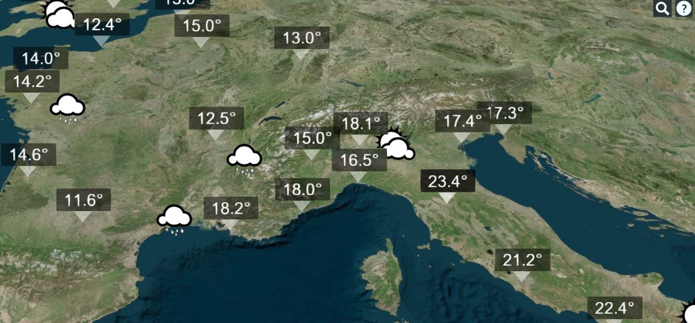

<h1>Simulation wheather forecast app</h1>
<h2>based on <a href="https://cesiumjs.org/">Cesium Js</a>, a free alternative to Google Earth</h2>

Since the Google Earth API has been deprecated and not supported after 2016, Cesium can become a good alternatives.

This prototype is very simple, but it will be not difficult to implement a more complex application with the use of real data supplied by free/paied weather service.

For example, <a href="http://openweathermap.org/">OpenWeatherMap</a> provides current weather data (available in JSON, XML) for any location on Earth

<a href="http://pafavero.github.io/weather-forecast-cesium/" target="_blank" >http://pafavero.github.io/weather-forecast-cesium/</a>

    <a href="http://pafavero.github.io/weather-forecast-cesium/" target="_blank" >Show preview</a>

  
